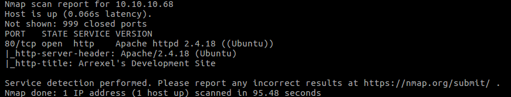
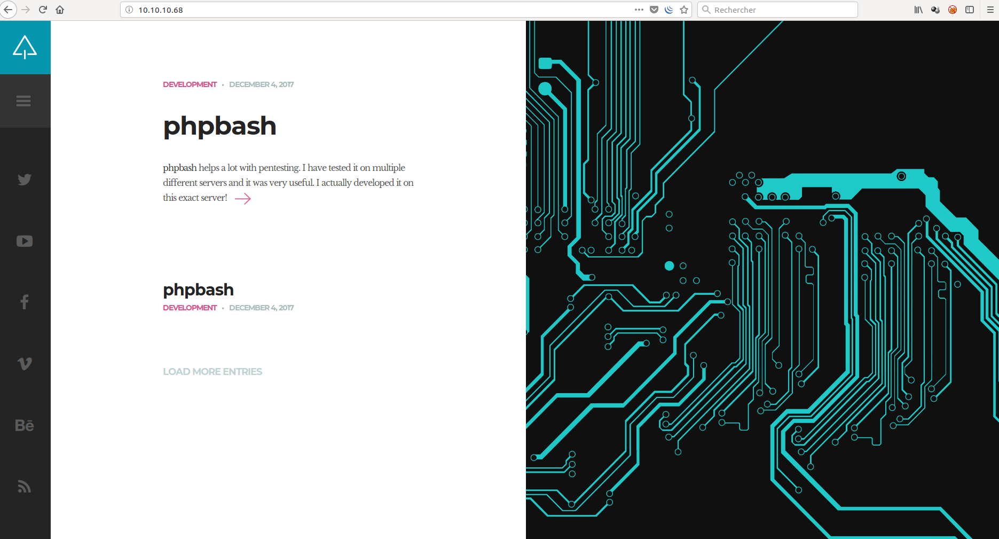
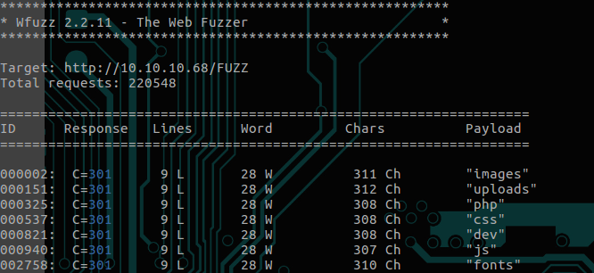
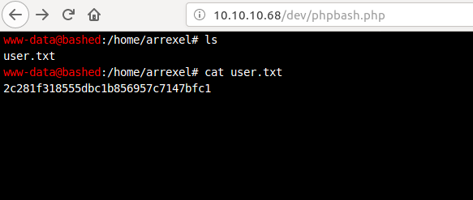
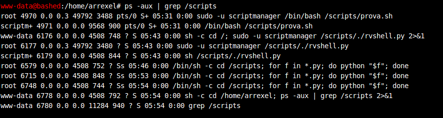

# BASHED - Linux

## Designation

    Linux box by Arrexel,  
    IP: 10.10.10.68

## walkthrough

We start with a nmap : sudo nmap -sC -sV 10.10.10.68

So there is only one open port, 80.  
Let's go to see this.

After spidering the website, i didn't find a entry point, so let's enumerate with wfuzz !

There is the dev directory wich show us two files : phpbash.min.php and phpbash.php .

So we go on http://10.10.10.68/dev/phpbash.php , that allow us a shell ! Go to the home directory .

Now privilege escalation !

There is a scripts folder that looks interesting .

As we can see, if we just create a .py file in script, it's run as root !

so :

    cd /scripts
    echo -n "open("/tmp/g","a").write(open("/root/root.txt").read())" > sehno.py

    cat /tmp/g

and flag root : cc4f0afe3a1026d402ba10329674a8e2

Thank you for reading !

Sehno
